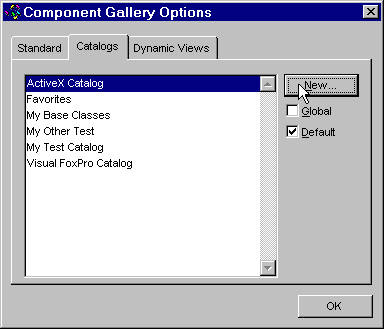
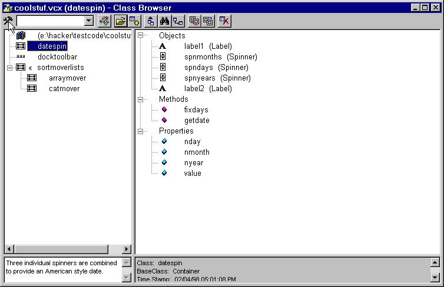
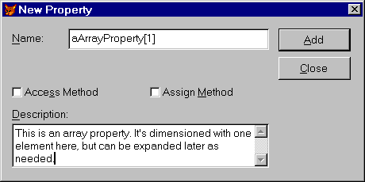
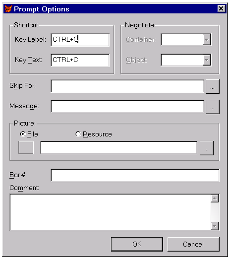
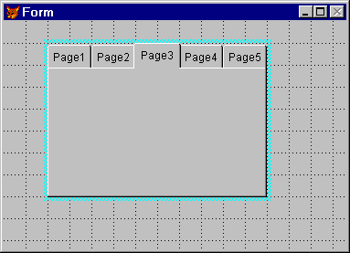
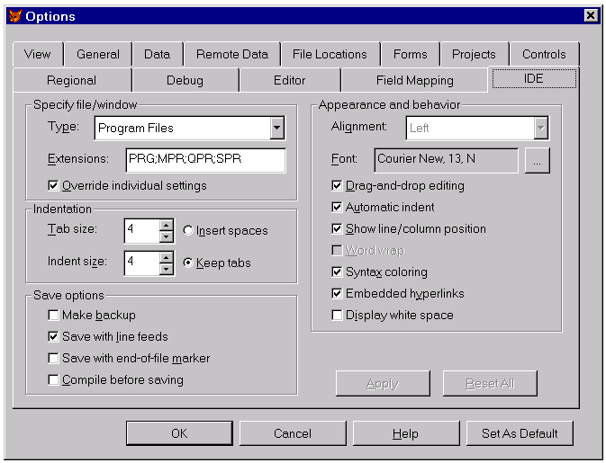

## Frequently Asked Power Tool Questions

Actually, some of these are frequently asked questions and
others are "we expect these to be frequently asked" questions about
things. There's a mix here of stuff we're tired of answering already (we hope
putting it here will cut down on the number of times we're asked) and things we
think will *be* like that.

If you don't see your question here, check out "It's a
Feature, Not a Bug"&mdash;more of this kind of stuff is there. Some other items
that might be on your "how do I" list may be covered in the other
chapters in Section 2 of this book. And if you still don't see your question,
try one of the public support forums for VFP. (See the appendix for a list of
places where kind folks answer questions and chat about FoxPro.)

<b>Q:</b> I'm using the
Component Gallery to organize all my stuff. But the built-in catalogs don't
really cover all the bases for me. I'd like to create some new catalogs. I've
tried right-clicking everywhere I can think of and I can't find any way to make
a brand new catalog.

<b>A:</b> We think the
design of this particular feature is terrible. Like you, we figured we'd be
able to right-click in the right pane of the Component Gallery while it
displays the list of catalogs, and then create a new one. But the Add Catalog
option there doesn't let you create a new one; it just adds a catalog that
already exists. There's a New option that appears sometimes, too, but it
doesn't include catalogs.

Instead, you have to click the Component Gallery's Options
button and then choose the Catalogs page. That page has a New button that lets
you create a new catalog. Click that button and specify a table to contain the
information for the new catalog. If, like us, you're not big fans of embedded
spaces in filenames, you can name the table with your preferred naming
convention, exit the dialog, right-click the new catalog in the Component
Gallery's left pane, and then choose Rename to give it a useful name. The
associated table retains the original name, but the Component Gallery shows the
new name. Figure 2-3 shows the Options dialog with the New button. 



#### Figure 2-3: New Options for Old&mdash;Since when does creating a new one of anything belong in an options dialog?

Frankly, we can't think of a much worse way to handle this.

<b>Q:</b> At
conferences, I've seen speakers grab a class from the Class Browser and drop it
somewhere else to create an instance. But I can never make this work when I try
it. What's the secret?

<b>A:</b> This is one of
those things that demos really well, but is just complex enough to be hard to
find on your own. It's really a two-step process. First, click the class you're
interested in. Then, grab the icon that appears above the listview (just below
the Browser's title bar). That's what you have to drag. The mouse pointer in
Figure 2-4 is pointing at the appropriate icon.



#### Figure 2-4: To drag an instance from the Class Browser, you have to choose the class, then drag the icon at the upper left. In this case, it's a hammer and wrench.

<b>Q:</b> I want to add
an array as a property of a class. But I can't figure out how to get FoxPro to
understand that the property is an array.

<b>A:</b> In coded
classes, this one is very simple. Just put the `DIMENSION` statement in the class
definition along with other properties. For example:

```foxpro
DEFINE CLASS Demo AS Custom
 
  DIMENSION aAnArray[7]
  cCharProperty = ""
 
  Name = "Demo Class"
ENDDEFINE
```
When you're creating classes in the Class Designer (or forms
in the Form Designer), it's not really any harder&mdash;you use the New Property
dialog. There are two ways to get there. The first works in all versions of
Visual FoxPro. Use the New Property item on the Class menu (or the Form menu in
the Forms Designer). In VFP 6 and later versions, you can choose Edit
Property/Method from the Class or Form menu, and then choose New Property from
that dialog. Once you reach the New Property dialog, when you enter the array
name, be sure to follow it with brackets (our preference) or parentheses and
the array dimensions. That's how FoxPro knows it's an array. Figure 2-5 shows
the New Property dialog with an array.



#### Figure 2-5: Adding an array property&mdash;don't forget the dimensions.

You can either specify the exact dimensions when you create
the array property, or you can redimension it in a method of the class. In
forms, we often use array properties to hold the items for a list or combo box.
In that case, we dimension the array as [1], and then redimension and populate
it with a query in the list or combo's Init method. 

Properties you add to a class are listed on the Other tab of
the Property Sheet. When you add an array property, you can see on the
PropSheet that it's an array, but you can't specify an initial value (as you
can with other properties you add). You have to do it in a method.

The thing we keep forgetting when dealing with array
properties is that, like other properties, you can't just refer to them by
name. You have to specify the containing object along with the property, or use
`This` or `ThisForm`. So, for example, if we use an array property of a form as the
`RowSource` for a combo on that form, the assignment looks like:

```foxpro
* This would be in the combo's Init:
This.RowSource = "ThisForm.aComboContents"
```
<b>Q:</b> I've specified
hotkeys for all my menu pads by preceding the hotkey in the prompt with
"\\<" (like "\\<File"). But when my users press ALT+F,
it doesn't activate the File menu.

<b>A:</b> Windows has
two ways to let users press keys and make things happen in the menu. You're
already using hotkeys, which let a user quickly choose an item when focus is
already on the menu. The other approach is menu shortcuts, which can be pressed
at almost any time to choose a menu item.

In VFP, hotkeys are specified by putting "\\<"
in front of the letter you designate to choose the item. Pressing that letter
chooses the item when the menu is already highlighted. Actually, it's a little
more complicated&mdash;the exact effect of pressing any letter depends on whether any
menu popups are open. (A hotkey for a menu pad works only if no other popups
are open.)

Shortcuts work when focus isn't on the menu or when the
popup containing the shortcut is open. Windows has a number of pretty standard
menu shortcuts, like CTRL+C for copy and CTRL+Z for undo. ALT+underlined
letter, used to open a menu popup, is also a shortcut (not a hotkey). It's
pretty standard to use ALT+some key for menu pads and CTRL+some key for menu
items.

In the Menu Builder, you specify shortcuts by clicking the Options
button for an item. In the dialog that appears, there's a section labeled
Shortcut. In the Key Label text box, press the key combination you want to use
as a shortcut. Then, if necessary, tab to the other text box and type the
description of the shortcut you want on the menu. Figure 2-6 shows you the
Prompt Options dialog. For a menu pad, you may want to make the description
empty, since no description appears anyway. For menu items, typically you use
something like CTRL+A. (VFP is smarter about this than it used to be, and the
default Key Text is usually what you want.)

One of the hardest tasks in an application can be finding
enough unique, yet meaningful, key combinations for all the menu shortcuts.



#### Figure 2-6: Specifying menu shortcuts&mdash;just click Options in the Menu Designer.

In code, you specify shortcuts with the `KEY` clause of the
`DEFINE PAD` or `DEFINE BAR` command. (We had to look that one up because it's been
years since we've defined a menu with code.)

<b>Q:</b> Whenever I try
to add controls to a page of a page frame, they wind up on top of the page
frame instead. I've been going to the Property Sheet and choosing the page I
want first, but that's really tedious. There must be a better way to do this!

<b>A:</b> Your question
can be generalized to a broader question: How do I edit the contents of a
container and not just the container itself? It applies to page frames, grids
and any other container objects.

As you've discovered, you can do it by brute force. Use the
combo in the Property Sheet to select the object you want to edit. But, as you
note, that's pretty tedious. We'd scream bloody murder if that were the only
way to do it.

Right-click to the rescue. Right-click any container object,
and the menu that appears includes Edit as one of its options. Choose Edit and
you have access to the items inside the container. Click on a page and it comes
to the top. You can then drop controls on it.

You can tell when you have access to the items inside a container
because there's a diagonally striped border around the container. Figure 2-7
shows a page frame with page 3 selected for editing.



#### Figure 2-7: The striped border (reminds us of a college tie) indicates you're editing the contents of a container, not the container itself.

With grids, it's a little more complicated. The Edit option
doesn't even appear in the right-click menu unless `ColumnCount` has a value
greater than 0. Once you choose Edit, you can click the header of a column to
select the header, or anywhere else in the column to select the column.

In VFP 7, this became much easier. Hold down the Ctrl key
while you click on a container object to automatically put it into
"edit" mode. But wait, it gets even better. To directly select a
contained object, put the mouse pointer over the object, hold down the Shift
and Ctrl keys, and click. This really saves right-clicking and choosing Edit
when you've got multiple levels of containership (say a text box inside a
container which sits on a page in a page frame).

Again, grids are a little different. Holding down Shift and
Ctrl while clicking on a column header of a grid doesn't select the column
header; it selects Column1, even if the mouse pointer was over the header of
Column3. Also, you can't select the control (usually a text box) inside a
column by clicking on it (with or without using the Shift or Ctrl keys). All
that happens is that you select the column. You have to use the combo box in
the Property Sheet to select any controls inside the column.

<b>Q:</b> If I change a
property in the Property Sheet, then decide I didn't really mean it, how do I
get rid of my change so that it inherits from the parent class again? When I
delete the value I entered or put back the old value, I still see the property
value in bold&mdash;that means I'm not inheriting, right?

<b>A:</b> Yep, boldface
in the Property Sheet means you're getting a custom value, not the inherited
value from the parent class. To get back to inheriting, choose the property in
the PropSheet. Then right-click. The first option is "Reset to
Default."

We think this is a really good item for the right-click
menu. It's easy to find and use. But we think it's really dumb that right-click
is the only way to get at this important item through the interface. What if
your mouse isn't working? What if you have a handicap that makes it hard to use
a mouse?

By the way, restoring a method to inherit is even easier
than for a property. Just delete all the custom code for the method and it'll
inherit from the parent class. One more "by the way"&mdash;you can restore
defaults programmatically by calling the object's ResetToDefault method and
passing the property or method you want to reset. For properties, it even works
at runtime.

<b>Q:</b> I'm trying to
figure out where the code for the `Click` method of a command button is located.
The command button on the form is an instance of a class that's a subclass of a
subclass of a VFP CommandButton. (For example, cmdOK is an instance of
OKButton, which is a subclass of MyCommandButton, which is a subclass of VFP's
CommandButton.)

<b>A:</b> There are
three ways you can determine the location of the code that executes when you
click the button.

First, the brute force way: Open the `Click` method of the
button and look there. If the code isn't there, check the `Class` and
`ClassLibrary` properties of cmdOK to see what class the button is an instance
of, close the form, open that class, and look at its `Click` method. If the code
isn't there, check the `ParentClass` and `ClassLibrary` properties to see what the
parent class of this class is, close the class, open the parent class, and look
at its `Click` method. Continue this process until you've found the code, or
until you find that the `ParentClass` is a VFP base class (which you can't open
and look at).

The brute force way gets old fast, especially because you
have to close the class you're currently looking at before you can open the
parent class.

The second way, new in VFP 7, is to look at the method in
the Property Sheet. If the method doesn't contain any code but there is some
code in this method somewhere in the class hierarchy, you'll see something like
"[Inherited MyCommandButton c:\projects\vfp\controls.vcx]", telling
you exactly where to look. You still have to close the form or class to open
the source class, but at least you don't have to check every class along the
way to find the right one.

The third way, added in VFP 6, is the best. If you open the
Class Browser or Component Gallery, a new toolbar with a single button is created.
This toolbar sticks around even after the Class Browser or Component Gallery
has been closed. The tooltip for the button, "Edit ParentClass
method", pretty much describes what it does for you. Open the editor
window for a method of an object or class, and then click on the button in this
toolbar. A text window appears, showing the code for this method from the first
class in the class hierarchy that has code in it (the one that VFP 7 shows you
that the method was inherited from). There's no syntax coloring, but you can
edit the code in the window if necessary. (When you close the window, you're
asked if you want to save the changes back to the parent class method.)

If, for some reason, you're stuck using Visual FoxPro 5.0 or
3.0, take a look around for Ken Levy's SuperClass utility. This will give you
the same functionality.

<b>Q:</b> When I create
a grid, it has a text box in each column. When I add the control I really want
in a column (say, a check box for a logical field), the default text box is
still there. How do I get rid of it so I don't have the overhead of an extra
control I'm not using?

<b>A:</b> This is one of
those things that's pretty clumsy. We keep hoping the Microsofties will come up
with something better.

In the Property Sheet, use the drop-down list to choose the
control you want to delete. Then click on the *title bar* of the form or of the Form Designer. Be careful not to
click on the form itself&mdash;that'll change the focus.

Now press Delete to remove the control you don't want.

Fortunately, adding a different control is much easier. Just
right-click and choose Edit on the grid to get inside, and then click the
column to give it focus. Click the control you want in the Form Controls
Toolbar and then click in the column to drop it.

<table>
<tr>
  <td width="20%" valign="top">

  </td>
  <td width="80%">
  <p>We were astonished to find that the Grid Builder doesn't handle this stuff automatically. If you specify a control other than a text box for a column in the Builder, the new control is added automatically. But the text box isn't removed. Why not? In our opinion, just plain bad design.</p>
  </td>
 </tr>
</table>

<b>Q:</b> The Command
Window is starting to annoy me because it's always on top of every other
window. How can I turn that off?

<b>A:</b> VFP 7 added
the ability to dock certain "system" windows, such as the Command,
Data Session, and Properties windows, just as you would a toolbar. This feature
is kind of cool, especially tab docking, which allows you to combine multiple
windows and select which one should be on top with a tab button.

However, this feature can also get in your way, especially
if you prefer that these windows behave the way they did in earlier versions.
Fortunately, it's very easy to turn off this behavior: Right-click in the title
bar of the window and choose "Dockable" from the shortcut menu. That
unchecks the item (selecting it again checks it and turns the behavior back on)
and the window reverts to the behavior it had in previous versions of VFP.

<b>Q:</b> I do a lot of
demos at my user group. It's a pain to have to change the font every time I
open an editor window or browse a table so everyone in the room can see it. How
can I change the default font and size that VFP uses for these windows?

<b>A:</b> Another
feature added in VFP 7 is the IDE tab in the Tools | Options dialog. This tab
allows you to specify the appearance and behavior of the different types of
windows available in the development environment. As you can see in Figure 2-8,
there are a lot of settings here!



#### Figure 2-8: The IDE tab of the Tools | Options dialog allows you to control the appearance and behavior of VFP windows.

The way this tab works is a little weird. (Actually, there
is a precedent for this behavior: the Debug tab works similarly. So, at least
they're consistently weird.) You have to select the window type you want to
change; the rest of the controls then reflect the settings for that window
type. Any controls that aren't applicable to the window type are disabled.

You can change all kinds of things in this tab, including
font and size, indentation, word wrapping, and save options. "Override
individual settings" is an interesting item. If it's unchecked, the
settings will only apply to windows you haven't yet opened in an editor (such
as new PRG files). For windows you have previously opened, the existing
settings, which are stored in your FoxUser resource file, are used. If you
check "Override individual settings", the settings in this tab are
used for all windows of a given type, regardless of any settings that were
previously used for individual windows.

To answer the question, change the font and size for each
window type (you have to do them one at a time), check "Override
individual settings", and click on Apply. When you're done changing all
the window types, click on Set as Default if you want to make these settings
permanent.

If you do a lot of demos, you might want to create another
Windows user login to use strictly for presentations. Use the same procedure
above, and Set as Default, to keep the settings for this user. Not only can you
set up VFP for presentations, you can also set up the desktop appearance (you
might look at the Windows Standard &ndash; Extra Large scheme on the Appearance tab
of the Desktop Properties dialog). You can also set it for the resolution of
your projection device, and clean up the menus to show only those shortcuts and
menu options you need for your demo (and you can clean off those shortcuts to
Microsoft Monster Truck Madness so nobody knows how you spend your free time).

<b>Q:</b> How do you
know all this stuff?

<b>A:</b> We'd like to
point out that it involves years of hard work, perseverance, perspiration and
brilliance, but no one would believe us.

The *Hacker's Guide* itself is a labor of love that's
consumed an incredible amount of time over the years, but we haven't mastered
VFP by locking ourselves away in a cave. There are lots of people (we thank a
lot of them in the Acknowledgements in the front of the book) who spend time
online sharing their expertise with others. They have helped us or taught us
many of the answers we share. CompuServe, the Universal Thread, Microsoft's
newsgroups, Usenet newsgroups and hundreds of Internet resources are
invaluable. In addition, we own many books on FoxPro, read a number of
periodicals and a fair number of non-FoxPro-specific books on subjects from
project management to user interface design (check out the Appendices for some
recommendations). We regularly attend conferences to keep up with what's going
on. We often resort to the Microsoft Knowledge Base (online or available on the
TechNet and MSDN CD-ROMs) to find out the latest documented anomalies. So,
while we all have pretty good memories, we keep our resources (especially the *Hacker's Guide*) within reach so that we
can answer those tough questions. 