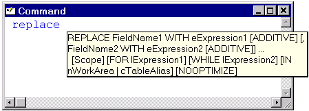
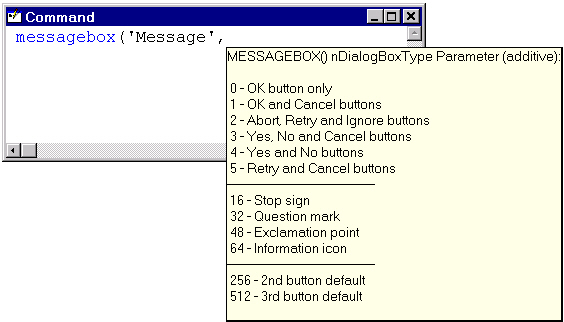
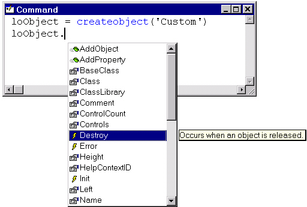
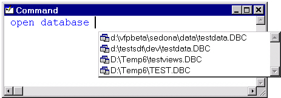
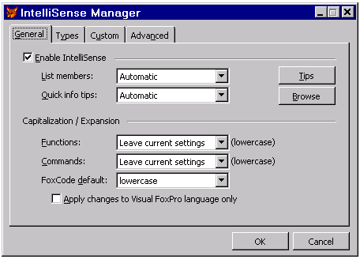

## IntelliSense and Sensibility

>We live less and less, and we learn more and more. Sensibility is surrendering to intelligence.  
>&mdash;Rémy De Gourmont, *Le Chemin de Velours*

Visual FoxPro developers have long had VB-envy, at least
with regard to one particular feature: IntelliSense. Type a statement such as
`Dim SomeVariable As` in Visual Basic and a list immediately pops up
of all of the types a variable can be defined as&mdash;data types as well as objects.
Type "SomeObject." and you're presented with a list of the properties,
events and methods for that object. This feature is a great productivity
booster for several reasons: You can quickly pick the item you want from the
list, it avoids spelling mistakes, and it cuts down on trips to the Help file
to figure out the syntax for a little-used command.

VFP 7 cures our inferiority complex by adding IntelliSense
to our beloved tool, and makes up for the long wait by providing a better
version of IntelliSense than Microsoft's other products have (in fact, the VFP
team has been showing their cool version to the other product teams). Once you
start appreciating how much more productive IntelliSense makes you, you'll
wonder how you ever coded without it.

IntelliSense provides VFP developers with several very
useful behaviors: automatic keyword completion, command and function syntax
tips, and lists of members, values, and most recently used files.

### You Complete Me

Xbase descendents have always supported two ways to enter
commands and functions: using the full, official keyword (such as `BROWSE`) or
using the first four or more characters (such as `BROW`). However, veteran
developers will tell you that while it's fine to use `REPL` in the
Command Window, you really should use the full `REPLACE` in code for
clarity.

IntelliSense gives us the best of both worlds: You can now
type just enough of a keyword to make it distinct, and then press the spacebar
or Enter in the case of a command or "(" in the case of a function,
and IntelliSense completes the keyword for you. Type "modi" and press
the spacebar, and IntelliSense replaces it with `MODIFY`. Because
some keywords start with the same set of characters, you have to type enough to
distinguish the keyword from similar ones. For example, for `MESSAGEBOX()`, you
can't just type "mess("; that gets expanded to "MESSAGE(".

Some commands, such as `ALTER TABLE`, `REPORT FORM`, and `OPEN
DATABASE`, consist of more than one keyword. Since the first keyword must always
be followed by the second, VFP automatically adds that keyword as well. Until
we got used to it, we found ourselves typing "`OPEN DATABASE DATABASE
MyData`" because we didn't notice that VFP automatically inserted
"DATABASE" as soon as we pressed the spacebar after typing
"open." Thank goodness, old dogs *can* learn new tricks.

VFP has a long list of SET commands, some of which you don't
use very often. IntelliSense helps out when you type "set" and press
the spacebar by displaying a list of each of the keywords that can follow it,
such as "deleted" and "exact." Some commands include the
word "to", such as `SET CLASSLIB TO`. As you'll see in "I Love
IntelliSense, Now Let's Change It" when we discuss the IntelliSense
Manager, you can tell IntelliSense whether it should automatically insert the
"to" or not (but we suggest you let it insert "to" and get
used to it).

By default, VFP uses uppercase when it expands keywords, so
even if you type the entire word "modify", VFP replaces it with
`MODIFY`. Fortunately for those who prefer lowercase (like Doug) or
even "camel" case (such as `TableUpdate()`), you can control
the case IntelliSense uses through the IntelliSense Manager (which we'll
discuss later in the section "I Love IntelliSense, Now Let's Change
It").

To prevent IntelliSense from expanding a keyword, you can
press Ctrl+Space rather than the spacebar at the end of the keyword. We haven't
come across a need to do that yet. To undo an expansion (which we have done),
press Ctrl+Z twice. The first Ctrl+Z removes the replacement and the second
restores the original keyword, leaving it selected.

### You Call That a Tip?

Our favorite IntelliSense feature is Quick Info. This
feature is a tip window showing the complete syntax of the command or function
you're in the process of typing. What a great productivity booster! How many
times do you find yourself bringing up the VFP Help file (or HackFox.CHM)
because you can't quite remember the exact syntax for `ALTER TABLE` or whether
the string to search is the first or second parameter in `AT()`? Figure 5-18
shows the Quick Info tip for the REPLACE command.



#### Figure 5-18: Quick Info saves you a trip to the Help file by displaying the complete syntax for commands and functions.

The tip window remains visible as you continue to type the
rest of a command or enter the parameters of a function, method, or event,
disappearing only when you move the cursor out of the scope of the keyword (for
example, completing a function with ")", pressing the the spacebar,
moving to another line, or moving the cursor with the arrow keys). You can
manually hide the tip window by pressing Esc and manually display it with
Ctrl+I or the Edit, Quick Info menu item. It's especially useful for
functions, methods and events because the parameter you're currently typing
appears in bold.

With some functions, the tip window displays information
about the values for a specific parameter. For example, the second parameter
for `MESSAGEBOX()` is an additive value for the buttons and an icon for the
dialog. IntelliSense makes it easy to figure out which ones to use by showing
the complete list of valid values for this parameter (see Figure 5-19). Other
functions accept only one of a list of predefined values for some parameters.
For instance, the second parameter in `DBGetProp()` specifies the type of data
object (connection, database, field, table, or view); the list of values for
the third parameter, the property, varies with the type of object (for example,
`DefaultValue` is available only for fields). For the type parameter,
IntelliSense displays a list of the object types; choose the desired type from
the list and IntelliSense inserts it, complete with quotes, in the command
line. The list of values displayed for the property parameter includes only
those applicable to the selected type; again, you can choose the property from
the list to add it to the command line.



#### Figure 5-19: The tip window for some functions shows detailed information about the current parameter.

The `SYS()` function is treated even more specially. Although
it's only one keyword, it really consists of a large number of functions, with
the specific function determined by the first parameter. IntelliSense displays
a list for this parameter showing not only the numeric values but also the
meaning for each one. Once you've selected the one you want, the tip window
shows the appropriate syntax for the rest of the function call.

### Members Only

We're not sure what we were thinking when we said earlier
that Quick Info was our favorite IntelliSense feature. Our favorite feature is
really List Members, because it does more to save us typing than any other.
When you enter the name of an object and press ".", VFP displays a
list of all members (properties, methods, events and contained members) of the
object. Figure 5-20 shows an example of this feature. As you navigate through
the list, a tip window shows the description of each member, once again saving
you a trip to the Help file.



#### Figure 5-20: IntelliSense's List Members feature displays the members of an object.

To add the selected member's name to the command line, press
Tab (the cursor appears right after the member name), Enter (the cursor moves
to the next line), or some non-alphabetical character such as Space,
".", "=", or "(" (the character is added at the
end of the member name). Press Home, End, Esc, or move the cursor out of the
scope of the object to hide the list. You can manually display the list by
pressing Ctrl+J or choosing List Members from the Edit menu.

If you like List Members so far, you'll love this: It works
in object hierarchies, too. Imagine how much you'd have to type to
programmatically change the caption of the header in the third column of a grid
on page 2 of a page frame in a form:

```foxpro
Thisform.PageFrame1.Page2.Grid.Column2.Header.Caption = "some value"
```
Oops, the name of the grid is actually grdCustomers, so when
you run this code, it'll bomb. List Members saves you from both making a
spelling mistake and having to type all that code; after you type the period
following Thisform, you can select PageFrame1 from the member list and press
"." to display the member list for the page frame, choose Page2 and
press "." to display the member list for that page, and so on, until
finally you choose Caption for the header and press "=" to close the
list.

List Members doesn't just work with native VFP objects; it
works with any instantiated object, such as an ActiveX control you've added to
a form or a COM object you've instantiated with `CREATEOBJECT()`. It even works
with objects you haven't instantiated yet but have declared your intention to
do so with the new `AS` clause in the `LOCAL` and `PUBLIC` commands. For example,
suppose you add this to your code:

```foxpro
LOCAL loExcel AS Excel.Application
```
In the rest of the code, when you type loExcel followed by a
period, IntelliSense sees that the variable has been "typed" as an
Excel.Application class, gets the members for that class by reading its type
library, and displays them in the List Members list. The `AS` clause doesn't instantiate
the object; you still have to do that in code. It just tells IntelliSense how
to treat a variable in the editor.

This feature works for any kind of class VFP can
instantiate, native or COM. After you type the `AS` keyword and press the
spacebar, a list of types appears. This list includes VFP data types (such as
Integer and Numeric), base classes (including Form and Custom), registered type
libraries (for example, ADODB and Excel), your own classes, and Web Services.
As with many things in VFP, the list of registered types is defined in a table,
so you can add type libraries, classes, Web Services, and other types by using
the IntelliSense Manager, discussed later.

### He's Making a List And Checking It Twice

Some object properties accept only a small range of values.
Properties with logical values, such as `Form.AutoCenter`, can only be set to .T.
or .F. `Form.BorderStyle` is numeric, but can accept only one of a selected list
of values (0 to 3). IntelliSense makes it easy to select the correct value for properties
like these. When you type "=" after certain property names,
IntelliSense displays a list of the valid values for those properties (and
their meanings, in the case of numeric values).

For properties with more complex values, IntelliSense
displays an appropriate dialog, such as a color picker for properties
representing colors (such as `BackColor`, `FillColor`, and `ForeColor`) and an Open
Picture dialog for properties containing image filenames (such as `Icon` and
`Picture`, although strangely enough, not for `DragIcon`, `MouseIcon` and
`OLEDragPicture`).

As with the List Members feature, List Values supports COM
objects as well as native ones. IntelliSense displays a list of values for
those properties with enumerations defined in the type library, such an ADO
Recordset object's CursorLocation and LockType properties.

IntelliSense extends the values list for the `REPLACE`, `MODIFY
MEMO` and `MODIFY GENERAL` commands: If a cursor is open in the current work area,
it displays a list of fields in that cursor. A value tip window shows the data
type, size, caption and comment for the selected field. In addition, if you
type "m." in the Command Window, IntelliSense displays a list of
declared variables. The value tip for each variable shows its current value.
Unfortunately, these features work only in the Command Window, not in an editor
window. Of course, you can always cut and paste from the Command Window into
your code, as you find yourself really loving how much work IntelliSense can do
for you.

The List Values feature doesn't have its own menu item or
hotkey; the List Members item and hotkey (Ctrl+J) serve the same function.

### What Have You Done For Me Lately?

Some VFP commands open or process files. Examples include
all the `MODIFY COMMAND`s (such as `MODIFY PROGRAM`), `OPEN DATABASE`, and `REPORT
FORM`. IntelliSense presents a most recently used (MRU) list for these commands,
making it easy to use a file you previously worked with. Figure 5-21 shows this
feature with the `OPEN DATABASE` command. You also get an MRU list of directories
with the `CD` command, which is really handy for those of us who hop back and
forth between different projects. The `USE` command has an MRU list on steroids:
In addition to tables you've opened before, it lists the tables and views in
the current database, along with a value tip window showing the comment for the
selected table or view. The "Auto MRU (Most Recently Used) Files"
topic in the VFP Help file has a complete list of commands with MRU lists.



#### Figure 5-21: The MRU list displayed by IntelliSense makes it easy to select a file you used before.

For reasons that escape us, this feature works only in the
Command Window. This is a shame, because when you're working on a particular
project, you're likely to use `OPEN DATABASE` or `USE` in your code on the same set
of files over and over.

You can specify how many items IntelliSense displays by
setting the "Most Recently Used list contains" option in the View
page of the Tools, Options dialog.

### I Love IntelliSense, Now Let's Change It

If you prefer that keywords appear in something other than
uppercase, you'll be frustrated typing them in your desired case only to see
VFP automatically change them to uppercase when it expands them. Similarly, you
might prefer to type the "to" yourself in a command, such as `SET
CLASSLIB TO` rather than inadvertently put in duplicates (`SET CLASSLIB TO TO`)
because you didn't notice that VFP inserted it for you. (In the latter case, we
recommend you get over it. It's just another habit you need to break.)

Fortunately, IntelliSense is data-driven. Most of its
settings are stored in a table, the name and path of which are stored in the
_FoxCode system variable. The default is FoxCode.DBF in your VFP
"user" folder (something like C:\Documents and
Settings\YourName\Application Data\Microsoft\Visual FoxPro).

The IntelliSense Manager, available in the Tools menu,
allows you to configure the behavior of IntelliSense. It has several pages of
settings. You can specify how the List Members, Quick Info, and keyword
expansion features work (such as what case to use when IntelliSense expands
keywords), or even disable IntelliSense altogether (although we can't imagine
why you'd want to do that) in the General page. The Types page allows you to
define the types listed for the AS clause of a `LOCAL`, `PUBLIC`, `LPARAMETERS`,
`PARAMETERS`, `FUNCTION`, or `PROCEDURE` declaration. By default, this list includes
VFP data types and base classes, but you can add other things, such as your own
classes, registered type libraries (for example, ADODB and Excel), and Web
Services.



#### Figure 5-22: You can configure the behavior of IntelliSense using the IntelliSense Manager.

The Custom page allows you to define your own shortcuts. VFP
comes with a few custom shortcuts already defined, such as "mc",
which expands to `MODIFY COMMAND`, and "mf", which expands to `MODIFY
FILE`. You can define your own shortcuts by entering the abbreviation to replace
and the text to replace it with. For example, you might add "mp" to
expand to `MODIFY PROJECT`, especially if you routinely work in multiple
projects. You can even create more complicated shortcuts by entering code that
should execute when you type the abbreviation. See the next section, "Please
Sir, I Want Some More," for information on scripting shortcuts.

Clicking the Edit Properties button in the Advanced page
displays a dialog in which you can fine-tune advanced IntelliSense behaviors,
such as whether a second keyword (such as "`TO`") is included when `SET`
commands are expanded, and whether the capitalization of keywords associated
with a command (such as `FROM` and `WHERE` in the `SQL SELECT` command) matches the
capitalization chosen for the command. Click the Cleanup button in the Advanced
page to display a dialog allowing you to restore the default settings for all
records in the FoxCode table (except the custom records you added), pack the
table, remove MRU file entries that no longer exist, or remove all MRU entries.

### Please Sir, I Want Some More

The IntelliSense Manager application, FoxCode.APP in the VFP
home directory, is more than just a fancy way to configure IntelliSense. It's
also the driving code for a lot of what IntelliSense does. A good portion of
the code is in support of scripting. (In case you're wondering how we knew
that, it's because we've actually gone through the code. Yes, the source code
for the IntelliSense Manager comes with VFP!)

Scripting allows you to define more complicated shortcuts
than simply expanding an abbreviation to some text. For example,
"dc", which is one of the predefined shortcuts, expands to the
following when it's entered in an editor window:

```foxpro
DEFINE CLASS classname AS Session OLEPUBLIC
 
PROCEDURE Init
 
ENDPROC
 
PROCEDURE Destroy
 
ENDPROC
 
PROCEDURE Error(nError, cMethod, nLine)
 
ENDPROC
 
ENDDEFINE
```
While that simply looks like a block of text, the
interesting part is that "classname" is automatically selected so you
can type the desired name of the class. That behavior requires some code. If
you look at the record for this shortcut in the FoxCode table (look near the
end of the table for a record with Abbrev = "dc"), you'll see the
following code in the Data memo field:

```foxpro
LPARAMETERS oFoxcode
 
IF oFoxcode.Location #1
   RETURN "DC"
ENDIF
 
oFoxcode.valuetype = "V"
 
TEXT TO myvar TEXTMERGE NOSHOW
DEFINE CLASS ~classname~ AS Session OLEPUBLIC
 
PROCEDURE Init
 
ENDPROC
 
PROCEDURE Destroy
 
ENDPROC
 
PROCEDURE Error(nError, cMethod, nLine)
 
ENDPROC
 
ENDDEFINE
 
ENDTEXT
 
RETURN myvar
```
The first line in this code is an `LPARAMETERS` statement. All
FoxCode script is passed a FoxCodeScript object. IntelliSense creates this
object, filling its properties with information about the FoxCode record, what
you typed, and the current environment (see the "FoxCode Object
Reference" topic in the VFP Help file for a description of each property
of this object). The "dc" script code checks the value of the
Location property and simply returns "DC" if it isn't 1. Location
indicates where you were typing when the shortcut was invoked; a value of 1
means the PRG editor. So, if you type this shortcut anywhere but in a PRG,
nothing appears to happen, which makes sense, because that's the only logical
place for a class definition. The return value, which must be a string, is
actually ignored, so a blank string could have been returned with the same
results.

Next, the code sets the ValueType property to "V".
This property specifies what happens after the script code is done;
"V" means IntelliSense replaces the shortcut with the return value of
the code (since it wasn't set earlier, IntelliSense ignored the previous
"DC" return value). The code then uses the Text command to place
several lines of text (in this case, the class definition code) into a variable
and returns that variable. Note the "\~" characters surrounding
"classname" in the text. A single "\~" tells IntelliSense
where to place the cursor after replacing the shortcut with the text (without a
"\~", it places the cursor at the end of the text), while two of them
specify text to highlight. This makes it easy for you to complete the text by
entering more information (such as the class name in this case). If you'd
rather use something other than "\~", set the CursorLocChar property
of the passed object to the desired character.

You can do even more complex things in the script code for a
shortcut. One of our favorite shortcuts inserts header comments at the start of
a program, including the name of the PRG file and the author's name, email
address, and company. None of this is hard-coded in the script, but is instead
read dynamically from the editor window title and the Windows Registry.

To create this shortcut, choose IntelliSense Manager from
the Tools menu, select the Custom page, type the abbreviation you want to use
(such as "header") in the Replace text box, and click on the Add
button to add the shortcut to the list. Click on the Script button to bring up
an edit window for the shortcut's script code, and enter the following code:

```foxpro
LPARAMETERS toFoxCode
LOCAL lcReturn, lcTable
IF toFoxCode.Location <> 0
  toFoxCode.ValueType = 'V'
  lcReturn = GetText()
ENDIF
RETURN lcReturn
 
FUNCTION GetText
LOCAL loRegistry, lcKey, lcCompany, lnResult, ;
  lcContact, lcAccount, lcEmail, lcText
loRegistry = NEWOBJECT('Registry', ;
  home() + 'FFC\Registry.vcx')
lcKey      = IIF('NT' $ OS() or '5.0' $ OS(), ;
  'Software\Microsoft\Windows NT\CurrentVersion', ;
  'Software\Microsoft\Windows\CurrentVersion')
lnResult   = loRegistry.GetRegKey('RegisteredOrganization', ;
  @lcCompany, lcKey, -2147483646)
IF lnResult <> 0
  lcCompany = ''
ENDIF
lnResult = loRegistry.GetRegKey('RegisteredOwner', ;
  @lcContact, lcKey, -2147483646)
IF lnResult <> 0
  lcContact = ''
ENDIF
lcKey    = 'Software\Microsoft\Internet Account Manager'
lnResult = loRegistry.GetRegKey('Default Mail Account', ;
  @lcAccount, lcKey, -2147483647)
IF NOT EMPTY(lcAccount)
  lcKey    = lcKey + '\Accounts\' + lcAccount
  lnResult = loRegistry.GetRegKey('SMTP Email Address', ;
    @lcEmail, lcKey, -2147483647)
ENDIF
IF lnResult <> 0 OR EMPTY(lcEmail)
  lcEmail = ''
ELSE
  lcEmail = ', mailto:' + lcEmail
ENDIF
TEXT TO lcText TEXTMERGE NOSHOW
*===============================================================
* Program:         <<WONTOP()>>
* Purpose:         ~
* Author:          <<lcContact>><<lcEmail>>
* Copyright:       (c) <<YEAR(DATE())>> <<lcCompany>>
* Last revision:   <<DATE()>>
* Parameters:
* Returns:
* Environment in:
* Environment out:
*===============================================================
 
ENDTEXT
RETURN lcText
```
After entering this code, close the edit window and click OK
to close the IntelliSense Manager.

Like the "dc" script, this code works only from a
code editor, not the Command Window; it uses textmerge to create the text to
replace the abbreviation in the command line; and, with the "\~"
character, it tells IntelliSense to put the cursor in the "Purpose"
comment line after the expansion is complete. It has a couple of interesting
wrinkles, though. First, it reads your name, company name, and email address
from the Registry using the FoxPro Foundation Classes (FFC) Registry class so
it can insert them into the header. Second, it uses `WONTOP()` to insert the name
of the file being edited. As you can see, script code can be considerably more
complex than simply outputting some text.

For information on how to create your own scripted
shortcuts, see the "Using Scripting in FoxCode.dbf" topic in the VFP
Help file.

### Winding Up

IntelliSense is a wonderful addition to the VFP development
environment. It helps you avoid spelling mistakes, boost your productivity, and
cut down on trips to the Help file. IntelliSense alone is worth the upgrade
cost to VFP 7. If you're like us, you'll find IntelliSense so compelling,
you'll even find yourself firing up VFP 7 when you have to maintain VFP 6
applications!